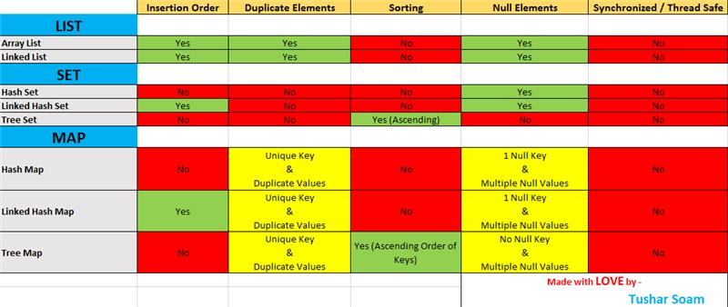

# Collections

Arrays are powerful, but restricted in their use their memory is fixed and cant be expanded dynamically in size once made.
  
They can also only by read sequentially. Which means that they are only read from start to finish. If you needed to access a point in the array you have to read through all the other entries before you reach what you want. This is called <i>Expensive-Linear</i>

Collections are frameworks that allow us to manipulate and store a grouop of objects. You can edit add delete and update in a collection framework.

In an Arraylist - Duplicate values are allowed no primitive datatypes are not allowed.

### Overview of legal functions for Collections

  

`ArrayList`: We want this type of collection as a class 
`<Integer>`: We want to manipulate this datatype 
`arrayList`: We have named it this

### Hierarchy of java collection framework

Maps are also a part of this framework

`.contains()` method checks for a specific object.

`.addAll()` adds an entire collection into another collection.

Iterable has a method called iterator

Generic is a type that can be used for any other type.

Features of lists:
- They arent sequential
- They are also dynamic and can be extended or deleted flexibly
- You can also have duplicate values 7 null values
- They can be randomly accessed by Getters & Setters
- It follows a fixed insertion order according to what is read.

Problems of an array:
- They can only contain primitives
- They are fixed sizes and once ran cant be manipulated.

Avantages of an array:
- Very memory efficient, unlike collections that need a buffer to that memory.

Problems of Collections:
- There arae limits to the amount they can contain, despite being dynamic.

### Interfaces CAN extend Interfaces.
### They can ALSO be nested like classes can.
