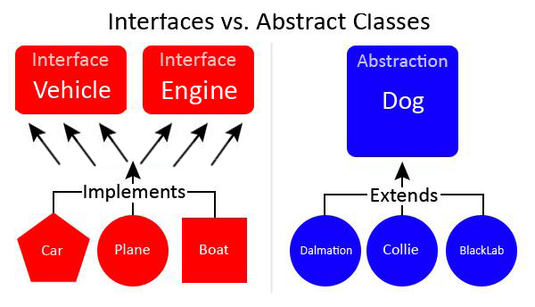

# Interface & Abstract Classes
Interfaces are classes that many children or sub classes share and use. All the methods in an interface are like the states that an object in the real world can have.
  
All car engines turn on and off

Children classes IMPLEMENT interfaces 
Children classes EXTEND parent classes
  
Both can also use the `@Override` annotation to adapt the methods in their parent class or interface as they want them.
  

### The difference between interface and abstract classes
Interfaces can have children classes that have different behaviours. A vehicle has a set amount of states but there are a range of behaviours that different vehicles have.  
Planes Fly • Cars Drive • Boats Float  
But these all fulfil the same purpose: to travel in motion.
  
Children classes can only extend with one Abstract class. 
Children classes can implement multiple interfaces. 

### The difference between an abstract class and a normal class
Abstract classes can have methods without a body.
