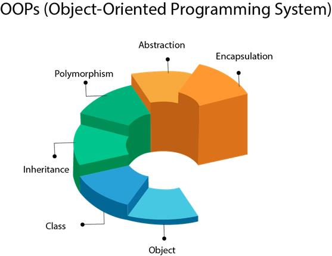

# The inception of   Object Oriented Programming
---
### Ransom E Olds  
Cars in the late 19th Century would be bespoke built upon request. This made it a high luxury item and very expensive to produce.
Ransom E olds conceived the concept of a production line for manufacturing cars and this is the earliest form of OOP (Object Oriented Programming)
  
We dont want production to be all done exclusively on one line.
Cars are made of parts and parts have their own production process that become components that constitute a final product.

Coding in java should always be treated the same.

---
# The 4 Principles of OOP

The principles of OOP are designed to model the real world with state & behaviour.

### Encapsulation
Like pills we hide what the contents are of an object we can do this by using `private` as the access modifier in our methods.   
This helps us model the information to determine what a user can see versus what a user cant see in terms of our application.

### Abstraction
Creating an interface without revealing how it works. Key in allowing user interfaces to work properly, where they can change information without changing how that operation works. It allows access to certain functions whilst not allowing others: like calling classes into the main
 
###### <i>Metaphor Time</i> 
You can change the gears of a car but you dont see how the clutch plates move, how the gears realign or how the engine changes rpm.

<i>Encapsulation hides the information from the user like personal data</i> 
<i>Abstraction hides the method from the user like how the app works</i> 

### Polymorphism

We can use the same method multiple times with method <i>'overloading'</i> aka. POLYMORPHISM. This allows us to have different actions for the same method. Keep note that the datatype it is looking for can cause conflict if there are multiple methods of the same data type
  
`@Override`
This allows you to supersede any methods in a child class that are already defined in a parent class. Allowing you to write your own version of that method in the child
  
If you ever need to retrieve methods from a parent in a child you need to use super inside that method.

---
# Hierarchy

 

###### Objects
are things like your methods and your variables these go into... 
###### Classes
that are the folders of methods, these classes can gain ...

###### Inheritance
From a parent class gaining methods and...
###### Polymorphism
Is gaining those methods and adapting them in different ways...

###### Abstraction
Are the methods you hide from the user not revealing how it is done. 
###### Encapsulation
Is the data that you hide form the user not showing the information kept.

---
# Breaking it down:
Coding is the tool to implement the solution to the problem. Figure out what you should do logically step by step to break a problem down:
  
An array of numbers: 
We want to find the highest, the lowest and the total of the arrays numbers:
 
##### 2,3,1,7,4
 
Break it down and then you can plan the structure of your code and build it properly in java.

##### The largest number:
- Look at the numbers in the array 
- Compare the values of those numbers in the array 
- If you find a number that is larger than the number you have currently selected. 
  - Discard it and grab that number 
- After you have checked all the numbers in the array like this 
- Show us the value you find.

##### The smallest number
- Look at the numbers in the array 
- Compare the values of those numbers in the array 
- If you find a number that is <b>smaller</b> than the number you have currently selected. 
  - Discard it and grab that number 
- After you have checked all the numbers in the array like this 
- Show us the value you find.

##### The total value of the array

- Look at the numbers in the array 
- Starting at the first value given 
  - Go to the next value and add it to the previous number. 
  - Repeat this for each number in the array 
  - Once you have reached the last number 
- Show us the value you find.
 

---
# Your Names:
<b><i>Classes</i></b> are 'nouns' and start with capitals 
<b><i>Methods</i></b> are 'verbs' and dont start with capitals
  
Make it readable naming should be as descriptive as possible so you can understand it better.  
99% of the time you are writing code for someone else so make sure it is readable to another person, explain the logic by naming things well.
  
<i>You could see it as...</i> 
<b>A noun is a class</b> 
<b>A verb is a method</b>  

---
### Strings
These are objects in java. 
Technically you can also see them as an array of characters, which are a primitive datatype.  
You can inspect strings with various methods as they are an object
  

---
### <i>Getters & Setters</i>  
Get & SET values for a class.

---
### Recursive Methods
This in Java is where a method calls itself inside its operations. It has an advantage in allowing the code to be much more stremalined. However it can be slow when not used properly.
